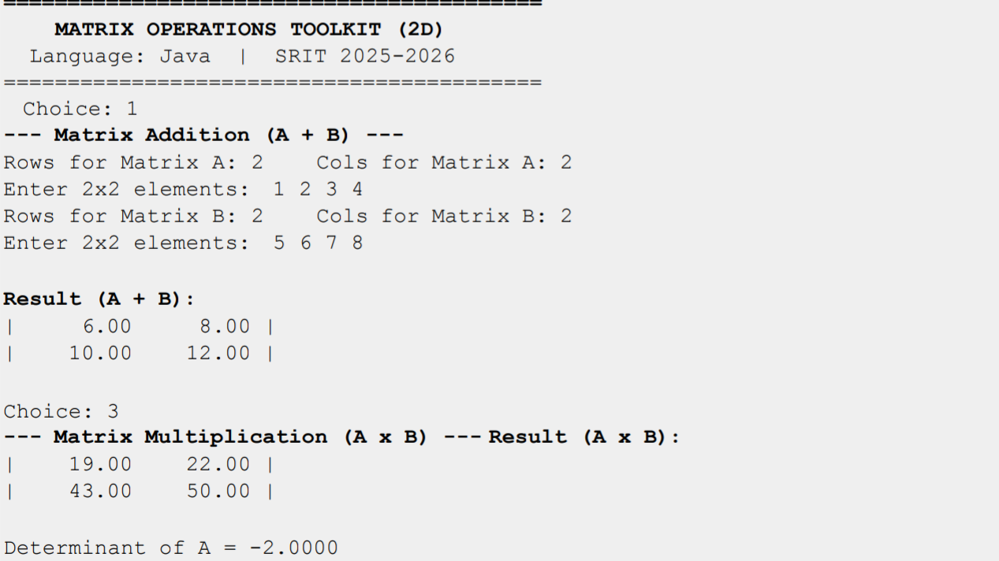

# Mini_Project

```java
import java.util.Scanner;

public class Matrix {

    private double[][] data;
    private int rows, cols;

    public Matrix(int rows, int cols) {
        this.rows = rows;
        this.cols = cols;
        this.data = new double[rows][cols];
    }

    public int getRows() {
        return rows;
    }

    public int getCols() {
        return cols;
    }

    public void readMatrix(Scanner sc) {
        System.out.println("Enter " + rows + "x" + cols + " elements:");
        for (int i = 0; i < rows; i++)
            for (int j = 0; j < cols; j++)
                data[i][j] = sc.nextDouble();
        sc.nextLine();
    }

    public void display() {
        System.out.println();
        for (int i = 0; i < rows; i++) {
            System.out.print("| ");
            for (int j = 0; j < cols; j++)
                System.out.printf("%8.2f ", data[i][j]);
            System.out.println("|");
        }
        System.out.println();
    }

    public Matrix add(Matrix other) {
        if (rows != other.rows || cols != other.cols)
            throw new IllegalArgumentException(
                "Addition requires same dimensions. Got "
                + rows + "x" + cols + " and "
                + other.rows + "x" + other.cols);

        Matrix result = new Matrix(rows, cols);

        for (int i = 0; i < rows; i++)
            for (int j = 0; j < cols; j++)
                result.data[i][j] = data[i][j] + other.data[i][j];

        return result;
    }

    public Matrix subtract(Matrix other) {
        if (rows != other.rows || cols != other.cols)
            throw new IllegalArgumentException(
                "Subtraction requires same dimensions.");

        Matrix result = new Matrix(rows, cols);

        for (int i = 0; i < rows; i++)
            for (int j = 0; j < cols; j++)
                result.data[i][j] = data[i][j] - other.data[i][j];

        return result;
    }

    public Matrix multiply(Matrix other) {
        if (cols != other.rows)
            throw new IllegalArgumentException(
                "Multiply: cols of A (" + cols +
                ") must equal rows of B (" + other.rows + ")");

        Matrix result = new Matrix(rows, other.cols);

        for (int i = 0; i < rows; i++)
            for (int j = 0; j < other.cols; j++)
                for (int k = 0; k < cols; k++)
                    result.data[i][j] += data[i][k] * other.data[k][j];

        return result;
    }

    public Matrix transpose() {
        Matrix result = new Matrix(cols, rows);

        for (int i = 0; i < rows; i++)
            for (int j = 0; j < cols; j++)
                result.data[j][i] = data[i][j];

        return result;
    }

    public double determinant() {
        if (rows != cols)
            throw new IllegalArgumentException(
                "Determinant requires a square matrix.");

        if (rows == 1)
            return data[0][0];

        if (rows == 2)
            return data[0][0] * data[1][1]
                 - data[0][1] * data[1][0];

        if (rows == 3) {
            double[][] d = data;

            return d[0][0] * (d[1][1] * d[2][2] - d[1][2] * d[2][1])
                 - d[0][1] * (d[1][0] * d[2][2] - d[1][2] * d[2][0])
                 + d[0][2] * (d[1][0] * d[2][1] - d[1][1] * d[2][0]);
        }

        throw new UnsupportedOperationException(
            "Determinant supported for 1x1, 2x2, 3x3 only.");
    }

    public Matrix inverse() {
        if (rows != 2 || cols != 2)
            throw new UnsupportedOperationException(
                "Inverse is supported for 2x2 matrices only.");

        double det = determinant();

        if (det == 0)
            throw new ArithmeticException(
                "Singular matrix — inverse does not exist.");

        Matrix result = new Matrix(2, 2);

        result.data[0][0] = data[1][1] / det;
        result.data[0][1] = -data[0][1] / det;
        result.data[1][0] = -data[1][0] / det;
        result.data[1][1] = data[0][0] / det;

        return result;
    }

    public Matrix scalarMultiply(double scalar) {
        Matrix result = new Matrix(rows, cols);

        for (int i = 0; i < rows; i++)
            for (int j = 0; j < cols; j++)
                result.data[i][j] = data[i][j] * scalar;

        return result;
    }
}
``` java
MatrixToolkit.java — Menu-Driven Driver Class

```
import java.util.Scanner;

public class MatrixToolkit {

    static Scanner sc = new Scanner(System.in);

    public static void main(String[] args) {

        boolean running = true;

        while (running) {
            printMenu();
            System.out.print("Choice: ");

            int choice;
            try {
                choice = Integer.parseInt(sc.nextLine());
            } catch (Exception e) {
                System.out.println("Enter valid number");
                continue;
            }

            try {
                switch (choice) {
                    case 1: add(); break;
                    case 2: sub(); break;
                    case 3: mul(); break;
                    case 4: trans(); break;
                    case 5: det(); break;
                    case 6: inv(); break;
                    case 7: scalar(); break;
                    case 8: running = false; break;
                    default: System.out.println("Invalid choice");
                }
            } catch (Exception e) {
                System.out.println("Error: " + e.getMessage());
            }
        }

        sc.close();
    }

    static void printMenu() {
        System.out.println("\n1.Add  2.Sub  3.Mul  4.Transpose");
        System.out.println("5.Det  6.Inv  7.Scalar  8.Exit");
    }

    static Matrix read(String name) {
        System.out.print("Rows of " + name + ": ");
        int r = Integer.parseInt(sc.nextLine());

        System.out.print("Cols of " + name + ": ");
        int c = Integer.parseInt(sc.nextLine());

        Matrix m = new Matrix(r, c);
        m.readMatrix(sc);
        return m;
    }

    static void add() {
        Matrix a = read("A");
        Matrix b = read("B");
        a.add(b).display();
    }

    static void sub() {
        Matrix a = read("A");
        Matrix b = read("B");
        a.subtract(b).display();
    }

    static void mul() {
        Matrix a = read("A");
        Matrix b = read("B");
        a.multiply(b).display();
    }

    static void trans() {
        Matrix a = read("A");
        a.transpose().display();
    }

    static void det() {
        Matrix a = read("A");
        System.out.println("Det = " + a.determinant());
    }

    static void inv() {
        Matrix a = read("A");
        a.inverse().display();
    }

    static void scalar() {
        Matrix a = read("A");
        System.out.print("Enter k: ");
        double k = Double.parseDouble(sc.nextLine());
        a.scalarMultiply(k).display();
    }
}

```
output :

